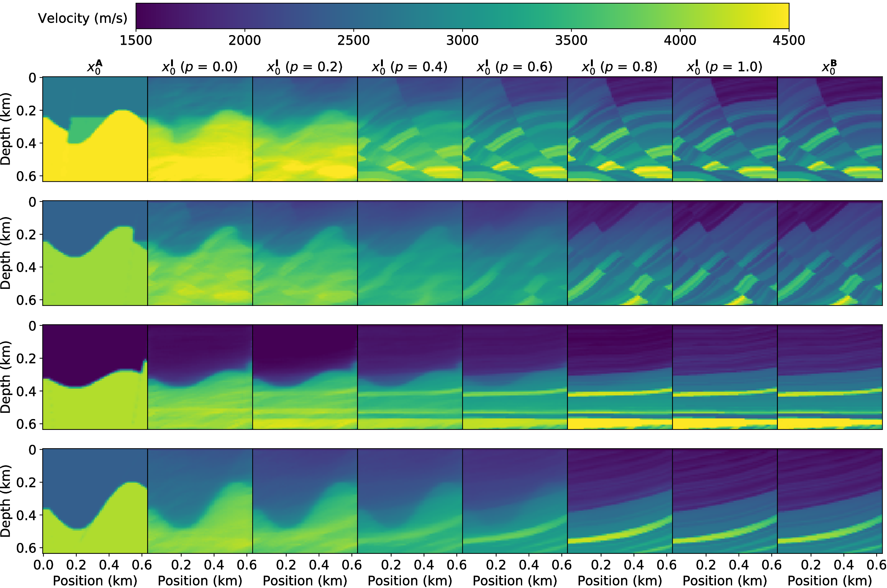

# SMDA: Velocity Profile Synthesis in Multi-Domain using Diffusion Autoencoders

---

We propose a velocity profile Synthesis approach by fusing Multi-domain existing data using Diffusion Autoencoder, dubbled as SMDA.
The key idea is to map different velocity profiles into the latent space using diffusion autoencoders.
By fusing them in latent space, diffusion models are then used to generate data with fused structure and semantics.

 

## Folder Description

/checkpoint: saving the intermediate results of network training  
/configuration: stored in configuration information  
/data:  velocity profile dataset  
/network: network architecture (U-Net noise prediction network + autoencoder)  
/sampled_imgs: stores the velocity profiles synthesized by smda.py and smda_for_single.py

## File Description

