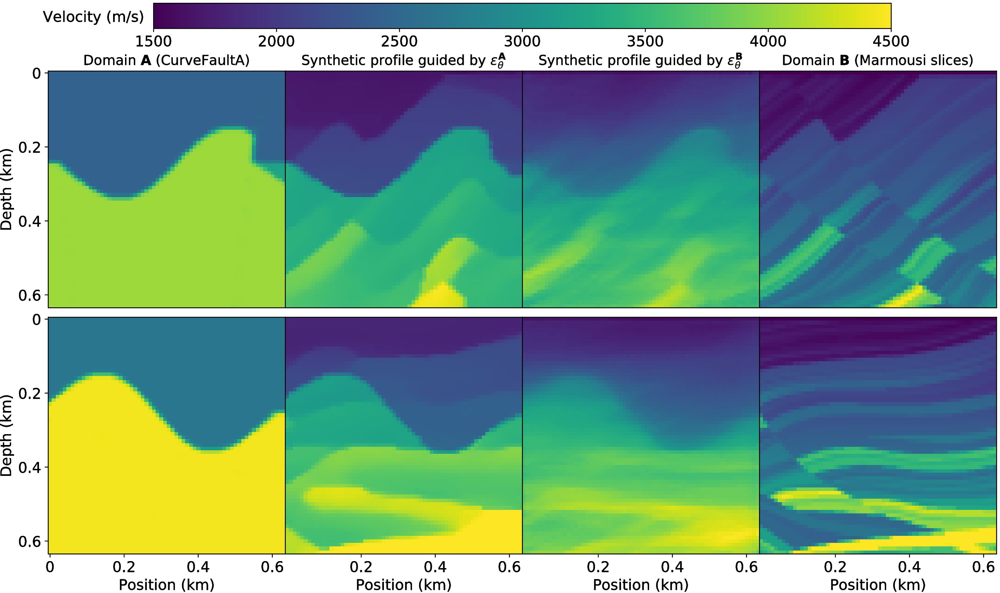

# SMDA: Velocity Profile Synthesis in Multi-Domain using Diffusion Autoencoders

---

We propose a velocity profile Synthesis approach by fusing Multi-domain existing data using Diffusion Autoencoder, dubbled as SMDA.
The key idea is to map different velocity profiles into the latent space using diffusion autoencoders.
By fusing them in latent space, diffusion models are then used to generate data with fused structure and semantics.

 

## Folder Description

- /checkpoint: saving the intermediate results of network training  
- /configuration: stored in configuration information  
- /data:  velocity profile dataset  
- /network: network architecture (U-Net noise prediction network + autoencoder)  
- /sampled_imgs: stores the velocity profiles synthesized by smda.py and smda_for_single.py

## File Description

- **diffusion.py**: It implements the reverse and forward generation process of DDIM, as well as the training of noise prediction network $\epsilon_\theta$.

- **eval_autoenc.py**: It will evaluate the training effect of the autoencoder.

- **eval_eps.py**: It will evaluate the training effect of the noise prediction network $\epsilon_\theta$.
(*Here, our evaluation approach is different from that proposed in the paper. We only use one DDIM encoding and decoding.
Specifically, it only implements encoding to one category of OpenFWI and decoding to another category of OpenFWI.
Its purpose is to evaluate whether DDIM is well trained and has reliable reconstruction capability.*)

- **smda_for_single.py**:  It implements SMDA on a single data pair (batch size = 1) (there is no batch synthesis module to control).

- **smda.py**:  It implements SMDA on multiple data pairs (a batch synthesis module is needed to control).

- **train_autoenc.py**: It is used to train the autoencoder.

- **train_eps.py**: It is used to train the noise prediction network $\epsilon_\theta$.

- **fwi_dataset.py**: It controls data reading and other operations related to DL-FWI

## Precautions

The data here are all velocity profiles (often called velocity models in the field of earth science), and no seismic observation records are provided.

If you need them, they will need to be generated locally via the forward simulation code.

In addition, we have made the M-SVP dataset mentioned in our paper public.
This is a dataset fused with CurveFaultA and Marmousi.
You can find them in the $$Data$$ folder, which contains a total of 24,000 velocity profiles.

 

