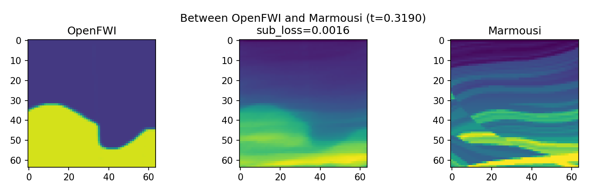

# Stores the velocity profiles synthesized by smda.py and smda_for_single.py

------------

The velocity profile synthesized by smda.py and smda_for_single.py will be stored here.

The two folders "npy" and "png" will store the corresponding types of files output by smda.py.

Output img: 
